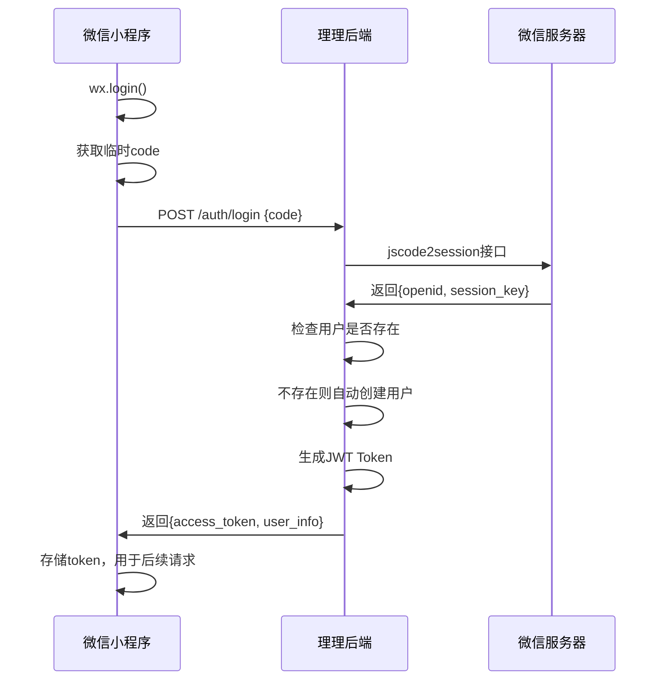

# 理理小程序后端API完整测试文档

## 概述

本文档详细说明如何使用 Postman 工具测试理理微信小程序后端的所有 API 接口，包括认证模块(Auth)和用户模块(User)。

## 微信小程序登录流程说明

### 标准登录流程

理理小程序采用标准的微信小程序登录流程：



### JWT Token说明

- **AccessToken**: 用于API访问认证，有效期24小时
- **RefreshToken**: 用于刷新AccessToken，有效期7天  
- **Token格式**: Bearer Token，请求头中携带：`Authorization: Bearer {access_token}`

## 测试环境配置

### 1. 基础设置

**测试服务器地址：**
```
http://localhost:8080
```

**API 基础路径：**
```
http://localhost:8080/api/v1
```

### 2. 全局变量设置

在 Postman 中创建环境变量：

| 变量名 | 值 | 描述 |
|-------|-----|------|
| `base_url` | `http://localhost:8080/api/v1` | API基础地址 |
| `access_token` | `通过登录获取` | JWT访问令牌 |
| `refresh_token` | `通过登录获取` | JWT刷新令牌 |
| `user_id` | `通过登录获取` | 当前用户ID |
| `openid` | `通过登录获取` | 当前用户OpenID |
| `wechat_code` | `测试用code` | 微信临时授权码 |

### 3. 认证设置

除登录和刷新接口外，所有接口都需要JWT认证：

```
Authorization: Bearer {{access_token}}
```

---

## 认证模块(Auth)API测试

### 1. 微信登录

**接口描述：** 通过微信授权code获取用户token，这是获取JWT令牌的第一步

**测试配置：**
- **方法：** `POST`
- **URL：** `{{base_url}}/auth/login`
- **Headers：**
  ```
  Content-Type: application/json
  ```

**请求体：**
```json
{
  "code": "{{wechat_code}}",
  "encryptedData": "",
  "iv": ""
}
```

**完整测试请求体（包含加密数据）：**
```json
{
  "code": "061234567890abcdef",
  "encryptedData": "CiyLU1Aw2KjiyGhlqkVwUQ==",
  "iv": "r7BXXKkLb8qrSNn05n0qiA=="
}
```

**期望响应：**
```json
{
  "code": 200,
  "message": "success",
  "data": {
    "access_token": "eyJhbGciOiJIUzI1NiIsInR5cCI6IkpXVCJ9...",
    "refresh_token": "eyJhbGciOiJIUzI1NiIsInR5cCI6IkpXVCJ9...",
    "expires_in": 86400,
    "token_type": "Bearer",
    "user_info": {
      "id": 1,
      "openid": "ox1234567890abcdef",
      "nickname": "微信用户",
      "avatar": "https://thirdwx.qlogo.cn/...",
      "phone": "",
      "status": 1
    }
  },
  "timestamp": 1640995200
}
```

**Postman脚本设置（Tests标签页）：**
```javascript
// 验证响应
pm.test("Status code is 200", function () {
    pm.response.to.have.status(200);
});

pm.test("Login successful", function () {
    var jsonData = pm.response.json();
    pm.expect(jsonData.code).to.eql(200);
    pm.expect(jsonData.data).to.have.property('access_token');
    pm.expect(jsonData.data).to.have.property('refresh_token');
    pm.expect(jsonData.data).to.have.property('user_info');
    
    // 自动设置环境变量
    if (jsonData.data.access_token) {
        pm.environment.set("access_token", jsonData.data.access_token);
        pm.environment.set("refresh_token", jsonData.data.refresh_token);
        pm.environment.set("user_id", jsonData.data.user_info.id);
        pm.environment.set("openid", jsonData.data.user_info.openid);
    }
});
```

**错误测试用例：**

1. **无效code测试：**
```json
{
  "code": "invalid_code_123"
}
```
期望响应：`{"code": 2006, "message": "微信授权码无效或已过期"}`

2. **缺少code参数：**
```json
{}
```
期望响应：`{"code": 400, "message": "请求参数格式错误"}`

**测试点：**
1. 验证登录成功返回token
2. 验证用户信息正确返回
3. 验证token格式正确
4. 验证新用户自动创建
5. 验证加密数据处理（如果提供）

---

### 2. 刷新Token

**接口描述：** 使用RefreshToken获取新的AccessToken

**测试配置：**
- **方法：** `POST`
- **URL：** `{{base_url}}/auth/refresh`
- **Headers：**
  ```
  Content-Type: application/json
  ```

**请求体：**
```json
{
  "refresh_token": "{{refresh_token}}"
}
```

**期望响应：**
```json
{
  "code": 200,
  "message": "success",
  "data": {
    "access_token": "eyJhbGciOiJIUzI1NiIsInR5cCI6IkpXVCJ9...",
    "refresh_token": "eyJhbGciOiJIUzI1NiIsInR5cCI6IkpXVCJ9...",
    "expires_in": 86400,
    "token_type": "Bearer",
    "user_info": {
      "id": 1,
      "openid": "ox1234567890abcdef",
      "nickname": "微信用户",
      "avatar": "https://thirdwx.qlogo.cn/...",
      "phone": "",
      "status": 1
    }
  },
  "timestamp": 1640995200
}
```

**Postman脚本设置：**
```javascript
pm.test("Refresh token successful", function () {
    var jsonData = pm.response.json();
    pm.expect(jsonData.code).to.eql(200);
    
    // 更新环境变量
    if (jsonData.data.access_token) {
        pm.environment.set("access_token", jsonData.data.access_token);
        pm.environment.set("refresh_token", jsonData.data.refresh_token);
    }
});
```

**错误测试用例：**
```json
{
  "refresh_token": "invalid_refresh_token"
}
```
期望响应：`{"code": 2005, "message": "RefreshToken无效或已过期"}`

---

### 3. 验证Token

**接口描述：** 验证当前token的有效性并获取用户信息

**测试配置：**
- **方法：** `GET`
- **URL：** `{{base_url}}/auth/verify`
- **Headers：**
  ```
  Authorization: Bearer {{access_token}}
  Content-Type: application/json
  ```

**期望响应：**
```json
{
  "code": 200,
  "message": "success",
  "data": {
    "user_info": {
      "id": 1,
      "openid": "ox1234567890abcdef",
      "nickname": "微信用户",
      "avatar": "https://thirdwx.qlogo.cn/...",
      "phone": "",
      "status": 1
    },
    "expires_in": 1640995200,
    "remaining_time": 7200
  },
  "timestamp": 1640995200
}
```

**测试点：**
1. 验证token有效性检查
2. 验证用户信息返回
3. 验证过期时间计算

---

### 4. 用户登出

**接口描述：** 登出用户，将token加入黑名单

**测试配置：**
- **方法：** `POST`
- **URL：** `{{base_url}}/auth/logout`
- **Headers：**
  ```
  Authorization: Bearer {{access_token}}
  Content-Type: application/json
  ```

**期望响应：**
```json
{
  "code": 200,
  "message": "success",
  "data": {
    "message": "登出成功"
  },
  "timestamp": 1640995200
}
```

**Postman脚本设置：**
```javascript
pm.test("Logout successful", function () {
    var jsonData = pm.response.json();
    pm.expect(jsonData.code).to.eql(200);
    
    // 清除环境变量
    pm.environment.unset("access_token");
    pm.environment.unset("refresh_token");
});
```

**测试点：**
1. 验证登出成功
2. 验证token被加入黑名单
3. 验证登出后无法使用该token访问其他接口

---

## 用户模块(User)API测试

> **重要提示：** 用户模块的所有接口都需要先通过认证模块获取有效的JWT Token！

### 1. 获取用户信息

**接口描述：** 获取当前用户的详细信息

**前置条件：** 必须先调用 `/auth/login` 获取 `access_token`

**测试配置：**
- **方法：** `GET`
- **URL：** `{{base_url}}/users/profile`
- **Headers：**
  ```
  Authorization: Bearer {{access_token}}
  Content-Type: application/json
  ```

**期望响应：**
```json
{
  "code": 200,
  "message": "success",
  "data": {
    "id": 1,
    "openid": "ox1234567890abcdef",
    "unionid": null,
    "nickname": "测试用户",
    "avatar": "https://thirdwx.qlogo.cn/...",
    "gender": 1,
    "city": "北京",
    "province": "北京",
    "country": "中国",
    "language": "zh_CN",
    "status": 1,
    "last_login_at": "2024-01-01T10:00:00Z",
    "created_at": "2024-01-01T09:00:00Z",
    "updated_at": "2024-01-01T10:00:00Z"
  },
  "timestamp": 1640995200
}
```

**测试点：**
1. 验证需要有效token才能访问
2. 验证响应数据结构完整
3. 验证用户状态为正常(status=1)

---

### 2. 更新用户信息

**接口描述：** 更新用户基本信息

**测试配置：**
- **方法：** `PUT`
- **URL：** `{{base_url}}/users/profile`
- **Headers：**
  ```
  Authorization: Bearer {{access_token}}
  Content-Type: application/json
  ```

**请求体：**
```json
{
  "nickname": "新昵称",
  "avatar": "https://example.com/new_avatar.jpg",
  "gender": 2,
  "city": "上海",
  "province": "上海",
  "country": "中国"
}
```

**部分更新测试：**
```json
{
  "nickname": "只更新昵称"
}
```

**期望响应：**
```json
{
  "code": 200,
  "message": "success",
  "data": {
    "id": 1,
    "openid": "ox1234567890abcdef",
    "nickname": "新昵称",
    "avatar": "https://example.com/new_avatar.jpg",
    "gender": 2,
    "city": "上海",
    "province": "上海",
    "country": "中国",
    "updated_at": "2024-01-01T11:00:00Z"
  },
  "timestamp": 1640995200
}
```

**错误测试用例：**
```json
{
  "gender": 3  // 无效性别值（有效值：0,1,2）
}
```
期望响应：400错误

**测试点：**
1. 验证信息更新成功
2. 验证updated_at时间戳更新  
3. 验证部分字段更新
4. 验证性别参数边界值测试
5. 验证参数类型验证

---

### 3. 获取用户偏好设置

**接口描述：** 获取用户的偏好设置

**测试配置：**
- **方法：** `GET`
- **URL：** `{{base_url}}/users/preferences`
- **Headers：**
  ```
  Authorization: Bearer {{access_token}}
  Content-Type: application/json
  ```

**期望响应：**
```json
{
  "code": 200,
  "message": "success",
  "data": {
    "id": 1,
    "user_id": 1,
    "notification_enabled": true,
    "price_alert_enabled": false,
    "warranty_reminder_enabled": true,
    "theme": "light",
    "language": "zh-CN",
    "created_at": "2024-01-01T09:00:00Z",
    "updated_at": "2024-01-01T10:00:00Z"
  },
  "timestamp": 1640995200
}
```

**测试点：**
1. 首次访问时返回默认偏好设置
2. 验证所有设置字段完整性
3. 验证默认值正确性

---

### 4. 更新用户偏好设置

**接口描述：** 更新用户偏好设置

**测试配置：**
- **方法：** `PUT`
- **URL：** `{{base_url}}/users/preferences`
- **Headers：**
  ```
  Authorization: Bearer {{access_token}}
  Content-Type: application/json
  ```

**完整更新请求体：**
```json
{
  "notification_enabled": true,
  "price_alert_enabled": true,
  "warranty_reminder_enabled": false,
  "theme": "dark",
  "language": "en-US"
}
```

**部分更新请求体：**
```json
{
  "theme": "dark"
}
```

**期望响应：**
```json
{
  "code": 200,
  "message": "success",
  "data": {
    "id": 1,
    "user_id": 1,
    "notification_enabled": true,
    "price_alert_enabled": true,
    "warranty_reminder_enabled": false,
    "theme": "dark",
    "language": "en-US",
    "updated_at": "2024-01-01T11:00:00Z"
  },
  "timestamp": 1640995200
}
```

**错误测试用例：**
```json
{
  "theme": "invalid_theme"  // 只接受 "light" 或 "dark"
}
```
期望响应：400错误

**测试点：**
1. 验证所有布尔值设置更新
2. 验证主题只接受"light"或"dark"
3. 验证部分字段更新
4. 验证不存在偏好设置时自动创建

---

### 5. 获取用户标签

**接口描述：** 获取用户的兴趣标签

**测试配置：**
- **方法：** `GET`
- **URL：** `{{base_url}}/users/tags`
- **Headers：**
  ```
  Authorization: Bearer {{access_token}}
  Content-Type: application/json
  ```

**期望响应：**
```json
{
  "code": 200,
  "message": "success",
  "data": [
    {
      "id": 1,
      "name": "数码产品"
    },
    {
      "id": 2,  
      "name": "家用电器"
    },
    {
      "id": 5,
      "name": "智能设备"
    }
  ],
  "timestamp": 1640995200
}
```

**无标签时响应：**
```json
{
  "code": 200,
  "message": "success",
  "data": [],
  "timestamp": 1640995200
}
```

**测试点：**
1. 验证返回用户已选择的标签
2. 验证无标签时返回空数组
3. 验证标签数据结构正确

---

### 6. 更新用户标签

**接口描述：** 更新用户的兴趣标签

**测试配置：**
- **方法：** `PUT`
- **URL：** `{{base_url}}/users/tags`
- **Headers：**
  ```
  Authorization: Bearer {{access_token}}
  Content-Type: application/json
  ```

**设置标签请求体：**
```json
{
  "tag_ids": [1, 3, 5, 7]
}
```

**清空标签请求体：**
```json
{
  "tag_ids": []
}
```

**期望响应：**
```json
{
  "code": 200,
  "message": "success",
  "data": [
    {
      "id": 1,
      "name": "数码产品"
    },
    {
      "id": 3,
      "name": "汽车用品"
    },
    {
      "id": 5,
      "name": "智能设备"
    },
    {
      "id": 7,
      "name": "运动器材"
    }
  ],
  "timestamp": 1640995200
}
```

**错误测试用例：**
```json
{
  "tag_ids": [1, 999]  // 包含不存在的标签ID
}
```
期望响应：`{"code": 400, "message": "存在无效的标签ID"}`

**测试点：**
1. 验证标签ID有效性检查
2. 验证标签关联更新（事务处理）
3. 验证清空所有标签功能
4. 验证返回更新后的标签列表

---

### 7. 获取用户统计信息

**接口描述：** 获取用户的设备统计信息

**前置条件：** 需要用户有设备数据才能看到完整统计

**测试配置：**
- **方法：** `GET`
- **URL：** `{{base_url}}/users/statistics`
- **Headers：**
  ```
  Authorization: Bearer {{access_token}}
  Content-Type: application/json
  ```

**期望响应：**
```json
{
  "code": 200,
  "message": "success",
  "data": {
    "total_devices": 15,
    "devices_by_category": {
      "手机": 3,
      "电脑": 2,
      "家电": 5,
      "汽车": 1,
      "其他": 4
    },
    "total_value": 125680.50,
    "average_hold_time_days": 365
  },
  "timestamp": 1640995200
}
```

**无设备用户响应：**
```json
{
  "code": 200,
  "message": "success",
  "data": {
    "total_devices": 0,
    "devices_by_category": {},
    "total_value": 0.0,
    "average_hold_time_days": 0
  },
  "timestamp": 1640995200
}
```

**测试点：**
1. 验证设备总数统计准确性
2. 验证分类统计数据
3. 验证总价值计算准确性
4. 验证平均持有时间计算
5. 验证无设备用户的边界情况

---

### 8. 注销用户账号

**接口描述：** 注销用户账号（软删除）

**⚠️ 警告：** 此操作不可逆，测试时请谨慎！

**测试配置：**
- **方法：** `DELETE`
- **URL：** `{{base_url}}/users/account`
- **Headers：**
  ```
  Authorization: Bearer {{access_token}}
  Content-Type: application/json
  ```

**请求体：**
```json
{
  "confirm": true
}
```

**期望响应：**
```json
{
  "code": 200,
  "message": "success",
  "data": {
    "message": "用户账号已成功注销"
  },
  "timestamp": 1640995200
}
```

**错误测试用例：**
```json
{
  "confirm": false  // 未确认注销
}
```
期望响应：`{"code": 400, "message": "必须确认注销操作"}`

**测试点：**
1. 验证必须确认才能注销
2. 验证注销后用户状态变更
3. 验证注销后无法再次访问用户接口
4. 验证相关数据的软删除

---

## 完整测试流程

### 阶段一：认证流程测试

**1. 获取微信授权码（模拟）**
```javascript
// 在微信小程序中实际调用
wx.login({
  success: function(res) {
    console.log('code:', res.code);
    // 将 res.code 设置到 Postman 环境变量 wechat_code 中
  }
});
```

**2. 执行认证接口测试顺序：**
1. 微信登录 (`POST /auth/login`) - 获取token
2. 验证Token (`GET /auth/verify`) - 验证token有效性
3. 刷新Token (`POST /auth/refresh`) - 测试token刷新
4. 登出 (`POST /auth/logout`) - 最后测试登出

### 阶段二：用户模块测试

**执行顺序（在获取token后）：**
1. 获取用户信息 (`GET /users/profile`)
2. 更新用户信息 (`PUT /users/profile`)
3. 获取用户偏好设置 (`GET /users/preferences`)
4. 更新用户偏好设置 (`PUT /users/preferences`)
5. 获取用户标签 (`GET /users/tags`)
6. 更新用户标签 (`PUT /users/tags`)
7. 获取用户统计信息 (`GET /users/statistics`)
8. 注销用户账号 (`DELETE /users/account`) - 最后测试

### 错误场景测试

**认证相关错误：**
1. 不携带Token访问用户接口 - 期望401错误
2. 携带无效Token - 期望401错误
3. 携带过期Token - 期望401错误
4. 使用已登出的Token - 期望401错误

**参数错误测试：**
1. 发送格式错误的JSON - 期望400错误
2. 发送超出范围的参数值 - 期望400错误
3. 发送空的必填参数 - 期望400错误

## 自动化测试脚本

### Postman Collection 完整配置

创建一个完整的测试集合，包含所有接口的测试：

```json
{
  "info": {
    "name": "理理小程序完整API测试",
    "description": "包含认证模块和用户模块的完整测试集合",
    "schema": "https://schema.getpostman.com/json/collection/v2.1.0/collection.json"
  },
  "auth": {
    "type": "bearer",
    "bearer": [
      {
        "key": "token",
        "value": "{{access_token}}",
        "type": "string"
      }
    ]
  },
  "event": [
    {
      "listen": "prerequest",
      "script": {
        "exec": [
          "// 通用预处理脚本",
          "pm.request.headers.add({key: 'Content-Type', value: 'application/json'});",
          "",
          "// 检查是否需要token",
          "const needsAuth = !pm.request.url.path.includes('/auth/login') && !pm.request.url.path.includes('/auth/refresh');",
          "if (needsAuth && !pm.environment.get('access_token')) {",
          "    console.log('警告: 此接口需要access_token，请先执行登录接口');",
          "}"
        ]
      }
    },
    {
      "listen": "test",
      "script": {
        "exec": [
          "// 通用响应验证",
          "pm.test('Response time is acceptable', function () {",
          "    pm.expect(pm.response.responseTime).to.be.below(5000);",
          "});",
          "",
          "pm.test('Response has correct structure', function () {",
          "    const jsonData = pm.response.json();",
          "    pm.expect(jsonData).to.have.property('code');",
          "    pm.expect(jsonData).to.have.property('message');",
          "    pm.expect(jsonData).to.have.property('timestamp');",
          "});",
          "",
          "// 错误响应验证", 
          "if (pm.response.code !== 200) {",
          "    pm.test('Error response format', function () {",
          "        const jsonData = pm.response.json();",
          "        pm.expect(jsonData.code).to.not.eql(200);",
          "        pm.expect(jsonData.message).to.be.a('string');",
          "    });",
          "}"
        ]
      }
    }
  ],
  "variable": [
    {
      "key": "base_url",
      "value": "http://localhost:8080/api/v1"
    }
  ]
}
```

### 测试数据准备脚本

```javascript
// 数据初始化脚本（在Collection的Pre-request Script中）
const testData = {
    wechat_code: "061234567890abcdef", // 测试用微信code
    test_user: {
        nickname: "测试用户",
        avatar: "https://thirdwx.qlogo.cn/test_avatar.jpg",
        gender: 1,
        city: "北京",
        province: "北京",
        country: "中国"
    },
    test_preferences: {
        notification_enabled: true,
        price_alert_enabled: false,
        warranty_reminder_enabled: true,
        theme: "light",
        language: "zh-CN"
    },
    test_tags: [1, 2, 3] // 测试标签ID
};

// 设置测试数据到环境变量
pm.environment.set("test_data", JSON.stringify(testData));
```

## 常见问题排查

### 1. 微信登录相关问题

**问题：** "微信授权码无效或已过期"
- **原因：** 微信code只能使用一次，有效期5分钟
- **解决：** 重新获取微信code，或使用测试环境的模拟code

**问题：** "数据解密失败"
- **原因：** encryptedData 或 iv 参数不正确
- **解决：** 确保从小程序端正确获取加密数据

### 2. Token相关问题

**问题：** "Token无效或已过期"
- **检查：** Token是否正确设置到环境变量
- **检查：** Token是否已过期（24小时有效期）
- **解决：** 重新登录获取新token

**问题：** "Token已失效"
- **原因：** Token在黑名单中（已登出）
- **解决：** 重新登录获取新token

### 3. 用户信息相关问题

**问题：** "用户不存在"
- **原因：** 数据库中没有对应的用户记录
- **解决：** 先调用登录接口创建用户

**问题：** "用户已被禁用"
- **原因：** 用户状态被设置为禁用
- **解决：** 检查数据库用户状态字段

### 4. 数据库相关问题

**问题：** "数据库操作失败"
- **检查：** 数据库连接是否正常
- **检查：** 数据表是否存在
- **检查：** 数据库权限是否正确

### 5. 网络相关问题

**问题：** 连接超时或404错误
- **检查：** 服务器是否正常运行
- **检查：** API路径是否正确
- **检查：** 防火墙设置

## 性能测试

### 基准测试指标

| 接口类型 | 响应时间要求 | TPS要求 | 说明 |
|---------|-------------|---------|------|
| 登录接口 | < 2000ms | > 100 | 包含微信API调用 |
| 用户信息 | < 500ms | > 500 | 简单查询 |
| 统计接口 | < 1000ms | > 200 | 复杂查询 |
| 更新接口 | < 800ms | > 300 | 数据更新 |

### 负载测试建议

1. **并发用户测试：** 模拟100-1000并发用户
2. **持续负载测试：** 连续运行30分钟以上
3. **峰值测试：** 模拟突发流量场景
4. **稳定性测试：** 长时间运行测试

## 安全测试

### SQL注入测试

在参数中注入SQL语句，验证系统防护：

```json
{
  "nickname": "'; DROP TABLE users; --",
  "gender": "1 OR 1=1"
}
```

### XSS攻击测试

```json
{
  "nickname": "<script>alert('xss')</script>",
  "city": ""
}
```

### 越权测试

使用其他用户的token访问接口，验证权限控制。

## 测试报告模板

### 测试结果记录

| 测试项目 | 测试结果 | 响应时间 | 备注 |
|---------|---------|---------|------|
| 微信登录 | ✅ 通过 | 1200ms | 正常 |
| Token刷新 | ✅ 通过 | 300ms | 正常 |
| 获取用户信息 | ✅ 通过 | 150ms | 正常 |
| 更新用户信息 | ✅ 通过 | 200ms | 正常 |
| ... | ... | ... | ... |

### 问题记录

| 问题描述 | 严重程度 | 状态 | 解决方案 |
|---------|---------|------|---------|
| 登录接口偶发超时 | 中 | 待修复 | 优化微信API调用 |
| ... | ... | ... | ... |

---

## 注意事项

### 测试环境

1. **环境隔离：** 使用专门的测试环境和测试数据
2. **数据备份：** 注销用户等破坏性测试前要备份数据
3. **并发测试：** 注意多用户同时测试可能的数据冲突
4. **资源清理：** 测试完成后及时清理测试数据

### 微信小程序特殊说明

1. **Code获取：** 需要在真实的小程序环境中调用`wx.login()`获取
2. **加密数据：** `encryptedData`和`iv`需要通过`wx.getUserInfo()`等接口获取
3. **测试限制：** 微信接口有调用频率限制，测试时需要注意
4. **环境差异：** 开发环境和生产环境的微信配置可能不同

### 最佳实践

1. **测试顺序：** 严格按照依赖关系执行测试
2. **异常处理：** 重点测试各种异常情况
3. **边界测试：** 测试参数的边界值
4. **兼容性：** 考虑不同版本客户端的兼容性

---

**文档版本：** v2.0  
**最后更新：** 2024-01-01  
**维护人员：** 开发团队

**更新日志：**
- v2.0: 新增认证模块完整测试内容，详细说明JWT获取流程
- v1.0: 初始版本，包含用户模块测试内容 